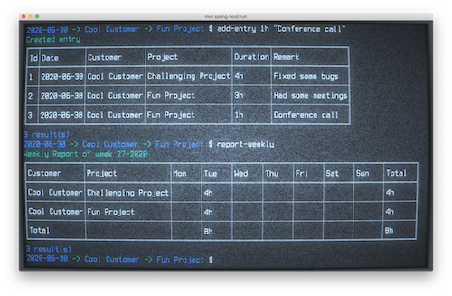

Timekeeper
==========


A Java/Spring boot based CLI Application to keep track of time spent on 
customers and projects.

You create customers and projects that belong to a single customer. Once you 
have created some customers and projects, you can select a customer and  a 
project. With a selected project, you can add time entries to that specific 
project.

You can view a weekly report and import/export your entries to a yaml file.

(And it looks super cool when viewed in [cool-retro-term](https://github.com/Swordfish90/cool-retro-term))  

Installation
------------
```
$ mvn clean package
```

Usage
-----

### Starting the application:
```
$ java -jar <location of jar>/<jarname>.jar 
```

When application is started, a local h2 database file is created in your home 
direcgtory (~/).

You get a customer prompt that shows the state of your session. When started, 
it only shows the entry date:
```
2020-07-06 $
```

In a few moments it will also show the selected customer/project:
```
2020-07-06 -> My test customer -> My First Project $
```

### Get help
A list of available commands:
```
2020-07-06 $ help
```
Get help on a command:
```
2020-07-06 $ help <command name>
```

### Creating and selecting customers
```
2020-07-06 $ customer-add "My test customer"
```
Result:
```
Created customer
╔══╤════════════════╗
║Id│Name            ║
╠══╪════════════════╣
║1 │My test customer║
╚══╧════════════════╝
2020-07-06 -> My test customer $
```
The modified prompt indicates that the newly create customer has also been 
selected.

If you have more than one customer, you can select a different customer:
```
2020-07-06 -> My test customer $ customer-select 2 // assumes a customer with id 2
2020-07-06 -> A different customer $
```

### Creating and selecting projects
Once you have one or more customers, you can add projects to the selected 
customer:
```
2020-07-05 -> My test customer $ project-add "My First Project"
```
Result:
```
Created project
╔══╤════════════════╤════════════════╗
║Id│Customer        │Name            ║
╠══╪════════════════╪════════════════╣
║1 │My test customer│My First Project║
╚══╧════════════════╧════════════════╝
2020-07-06 -> My test customer -> My First Project $
```
The prompt indicates that the newly created project is a child of the customer 
and has been selected.

### Adding time entries
We have a selected project so we're ready to enter some times:

```
$ entry-add 1h30m "Fixed the bug causing the application to crash"
```
Result:
```
Created entry
╔══╤══════════╤════════════════╤════════════════╤════════╤══════════════════════════════════════════════╗
║Id│Date      │Customer        │Project         │Duration│Remark                                        ║
╠══╪══════════╪════════════════╪════════════════╪════════╪══════════════════════════════════════════════╣
║1 │2020-07-06│My test customer│My First Project│1h 30m  │Fixed the bug causing the application to crash║
╚══╧══════════╧════════════════╧════════════════╧════════╧══════════════════════════════════════════════╝
1 result(s)
2020-07-06 -> My test customer -> My First Project $
```
The command confirms that entry that has been created and shows a list of all 
entries for the given date.

You can modify an entry by id:
```
$ entry-change 1 120m
```

```
Changed entry
╔══╤══════════╤════════════════╤════════════════╤════════╤══════════════════════════════════════════════╗
║Id│Date      │Customer        │Project         │Duration│Remark                                        ║
╠══╪══════════╪════════════════╪════════════════╪════════╪══════════════════════════════════════════════╣
║1 │2020-07-06│My test customer│My First Project│2h      │Fixed the bug causing the application to crash║
╚══╧══════════╧════════════════╧════════════════╧════════╧══════════════════════════════════════════════╝
1 result(s)
2020-07-06 -> My test customer -> My First Project $
```
### Selecting a different date
You can select a different date (either to view entries for that date or
to add entries for that date)
```
$ next-day // Go to next day
$ previous-day // Go to previous day
$ set-date 1 1 2020 // Set specific date
$ today // Set date to today
```

### Reporting
You can get a nice weekly report:

```
$ report-weekly
```
Result:
```
Weekly Report of week 28-2020
╔════════════════╤════════════════╤══════╤══════╤══════╤══════╤══════╤══════╤══════╤═══════╗
║Customer        │Project         │Mon   │Tue   │Wed   │Thu   │Fri   │Sat   │Sun   │Total  ║
╠════════════════╪════════════════╪══════╪══════╪══════╪══════╪══════╪══════╪══════╪═══════╣
║My test customer│My First Project│2h    │      │      │      │      │      │      │2h     ║
╟────────────────┼────────────────┼──────┼──────┼──────┼──────┼──────┼──────┼──────┼───────╢
║Total           │                │2h    │      │      │      │      │      │      │2h     ║
╚════════════════╧════════════════╧══════╧══════╧══════╧══════╧══════╧══════╧══════╧═══════╝
2 result(s)
2020-07-06 -> My test customer -> My First Project $
```

### Exporting/importing data
You can backup your data to a yaml file:
```
$ export <path>/export.yaml
```
The resulting file contains all your registered data in nice, human 
readable/editable format.

The same file can be imported again. Caution: During an import, all existing 
data will be deleted!
```
$ import <path>/export.yaml --confirm
```


